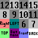
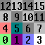
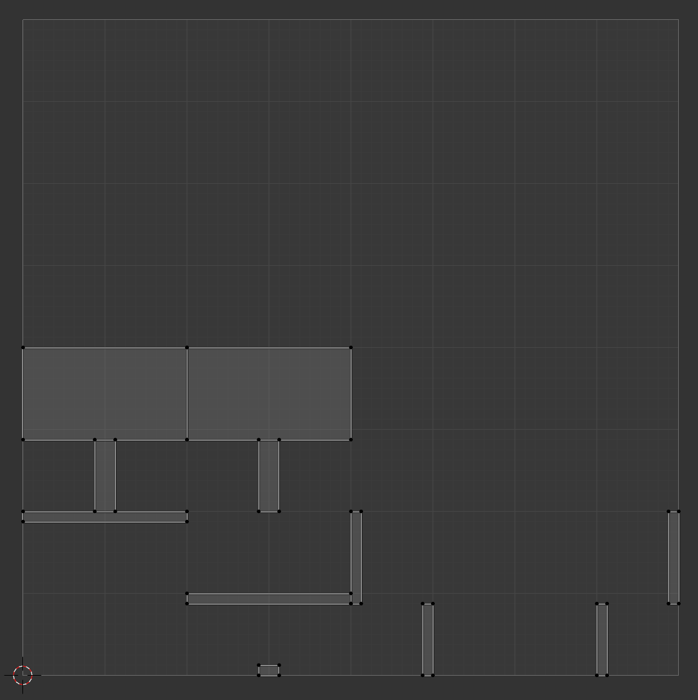
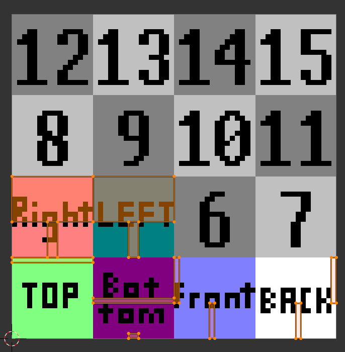

# Models

## Introduction

Cubyz uses `.glb` ([Graphis Library Transmission Format, binary variant](https://en.wikipedia.org/wiki/GlTF))
as a primary block model file format. You should be able to export `.glb` files from most propular 3D modelling software (eg. [Blockbench](https://www.blockbench.net/) or [Blender](https://www.blender.org/).).

For backwards compatibility Cubyz also supports `.obj` ([Wavefront OBJ](https://en.wikipedia.org/wiki/Wavefront_.obj_file))
files, however, the Cubyz project intends to phase out support for this format over time, due to its technical limitations.

When creating your model, you have to be aware that Cubyz uses **Z up** coordinate space.

Moreover, **UV coordinate space is partitioned into 16 texture slots**. Each texture slot can be
assigned a separate 16x16 texture. For your model to work correctly, you have to correctly
assign UV coordiantes to verticies of the model, so they are aligned with correct texture slots.

Please view reference textures below to ease the process.

## Reference Textures

<figure markdown="span">
  { width="300" }
  <figcaption>Reference texture with word based mapping</figcaption>
</figure>

<figure markdown="span">
  { width="300" }
  <figcaption>Reference texture with number based mapping</figcaption>
</figure>

<figure markdown="span">
  { width="300" }
  <figcaption>UV mapping for sign model viewed in Blender 4.1</figcaption>
</figure>

<figure markdown="span">
  { width="300" }
  <figcaption>UV mapping for sign model viewed in Blender 4.1 with reference texture in the background</figcaption>
</figure>

## List of Texture Fields

| Direction suffix fields | Index suffix fields |
| :--- | |
| `texture_top` | `texture0` |
| `texture_bottom` | `texture1` |
| `texture_front` | `texture2` |
| `texture_back` | `texture3` |
| `texture_right` | `texture4` |
| `texture_left` | `texture5` |
| | `texture6` |
| | `texture7` |
| | `texture8` |
| | `texture9` |
| | `texture10` |
| | `texture11` |
| | `texture12` |
| | `texture13` |
| | `texture14` |
| | `texture15` |

Alongside dedicated slots listed above, there is also `texture` (no suffix) field which is applied to all faces.

## Configuring textures and models

To set block the texture, you need to reference it through its ID.
Texture IDs always start with name of your addon, followed by colon and relative path to the texture inside `blocks/textures/` directory of your addon.
For example, `Cubyz` contains sign texture `oak.png` file in `cubyz/blocks/textures/sign/oak.png`, thus its ID will be `cubyz:sign/oak`.

To set a model in block `*.zig.zon` configuration file, you have to reference it using its ID.
Model IDs always start with name of your addon, followed by colon and relative path to the model inside `models` directory of your addon.
For example, `Cubyz` contains `sign.obj` file in `cubyz/models/sign/side.obj`, thus its ID will be `cubyz:sign/side`.

You are allowed to reference models and textures from base game / other addons (as long as they are installed) by using correct IDs to do so.

## Example

Workbench is a cube block with differnet texture on each side. See contents of `workbench.zig.zon` configuration file
below:

```zig title="workbench.zig.zon" linenums="1"
.{
	.tags = .{.choppable},
	.blockHealth = 10,
	.drops = .{
		.{.items = .{.auto}},
	},
	.onInteract = .{
		.type = .open_window,
		.name = "workbench",
	},
	.model = "cubyz:cube",
	.rotation = "cubyz:planar",
	.texture = "cubyz:workbench_back",
	.texture_front = "cubyz:workbench_front",
	.texture_left = "cubyz:workbench_side",
	.texture_right = "cubyz:workbench_side",
	.texture_top = "cubyz:workbench_top",
	.texture_bottom = "cubyz:workbench_bottom",
}
```
